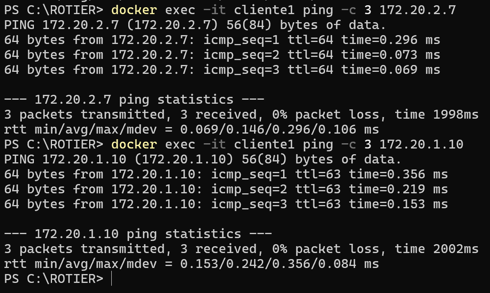

# Projeto Parcial: Infraestrutura de Rede em Docker

## Informacoes Gerais
**Disciplina**: Serviços de Redes de Computadores - 5º Período  
**Professor**: Roitier Campos Gonçalves  
**Grupo**: Emiliano Ferreira de Souza Junior, Mário Alves Fernandes Neto, Hugo Symon Donega de Moura  
**Entrega**: 29/04/2025  
**Valor**: 5 pontos  

## Objetivo
Implementar uma infraestrutura de rede corporativa básica, usando Docker, com serviços essenciais como DNS, DHCP, Firewall, LDAP, SAMBA, FTP e Web Server, organizados em sub-redes e interligados por um container roteador.

## Requisitos Técnicos
- Docker Compose
- Duas sub-redes:
  - **172.20.1.0/24**: Servidores
  - **172.20.2.0/24**: Clientes
- Roteador como gateway entre as redes
- Execução automatizada com `docker-compose up`

## Estrutura do Projeto
```
.
├── containers/
│   ├── cliente/
│   ├── dhcp/
│   ├── dns/
│   ├── firewall/ (embutido no router)
│   ├── ftp/
│   ├── ldap/
│   ├── router/
│   ├── samba/
│   └── web/
├── docker-compose.yml
├── volumes/ (dados persistentes)
└── README.md
```

## Serviços Implementados
### 1. DNS (Bind9)
- Resolve nomes como `web.intranet.local`.
- Zonas direta e reversa criadas.
- IP: `172.20.1.10`

### 2. DHCP (ISC DHCP Server)
- Atribui IP dinâmico aos clientes da rede `172.20.2.0/24`.
- Configurado com DHCP Relay no roteador.
- IP: `172.20.1.12`

### 3. Firewall (iptables)
- Integrado ao container **router**.
- Regras de forwarding e NAT entre sub-redes.
- IPs do roteador: `172.20.1.7` (servidores), `172.20.2.7` (clientes)

### 4. LDAP (OpenLDAP)
- Diretório de autenticação centralizado.
- Base DN: `dc=intranet,dc=local`
- IP: `172.20.1.18`

### 5. SAMBA
- Compartilhamento de arquivos via rede.
- Diretório: `/srv/samba_share`
- IP: `172.20.1.20`

### 6. FTP (vsftpd)
- Acesso restrito com modo passivo configurado.
- Portas: 2121 (ativa), 20000-21000 (passiva)
- IP: `172.20.1.16`

### 7. Web Server (Apache)
- Index HTML de boas-vindas
- IP: `172.20.1.14`, porta: `8080` (externa)

## Roteador
- Contém NAT, DHCP Relay e IP Forwarding ativados
- Conecta as redes clientes e servidores

## Cliente (cliente1)
- Recebe IP via DHCP
- DNS: configurado para `172.20.1.10`
- Scripts de entrada automatizam testes de conectividade

## Testes Automatizados
Os testes são executados automaticamente na inicialização do container `cliente1`. O resultado pode ser verificado via:
```bash
docker logs cliente1
```

### Testes Executados:
1. **IP via DHCP**
```bash
ip a
```
2. **Ping para Roteador (clientes)**
```bash
ping -c 3 172.20.2.7
```
3. **Ping para Roteador (servidores)**
```bash
ping -c 3 172.20.1.7
```
4. **Ping para DNS**
```bash
ping -c 3 172.20.1.10
```
5. **Ping para Web Server**
```bash
ping -c 3 172.20.1.14
```
6. **DNS Resolution (exemplo)**
```bash
dig web.intranet.local @172.20.1.10
```
7. **HTTP Request**
```bash
curl http://web.intranet.local
```
8. **FTP Connection**
```bash
ftp -inv 172.20.1.16
```

### Prints de Verificação

<p align="center">
  
</p>

<p align="center">
  
</p>

<p align="center">
  
</p>

<p align="center">
  
</p>

<p align="center">
  
</p>

## Execução
```bash
docker-compose up --build
```


Instituto Federal Goiano, 2025.

